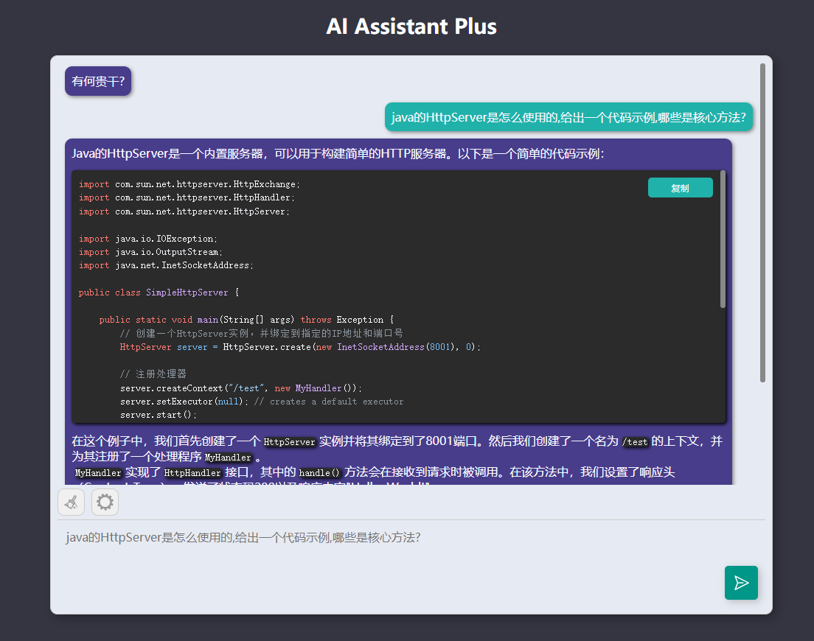

# AI-Assistant-Plus

该项目旨在扩展AI的能力，通过赋予AI调用外部命令的能力，帮助用户完成各种需求。 AI助手Plus具备以下特点和能力：

- 完整的AI原生能力：享受完整的丝滑大模型，支持各大平台的AI语言模型
- 实时获取网页信息：能够通过http工具实时访问网页并提取需要的信息。
- 谷歌搜索引擎：能够通过google工具进行实时搜索获取相关内容的标题、简介和链接。
- 数学计算能力：能够通过calc工具进行数学计算，包括复杂的数学表达式。
- 数据库操作：具备执行数据库操作的能力，能够通过db工具执行SQL语句对数据库进行操作。(需要事先配置数据库连接)

 

## 工具模型
- 原生：无工具调用能力,享受丝滑原生AI
- 工具扩展(命令模式)：有工具调用能力,通过[工具]参数[工具]调用工具
- 工具扩展(格式模式)：有工具调用能力,通过[思考,动作,输入]调用工具
- 工具扩展(官方)：有工具调用能力,通过官方原生API实现调用工具

## 语言模型
- 通义千问：通义千问,国产之光
- GPT 3.5：ChatGPT3.5,开山鼻祖
- GPT 4：ChatGPT4,AGI时代的到来
 
