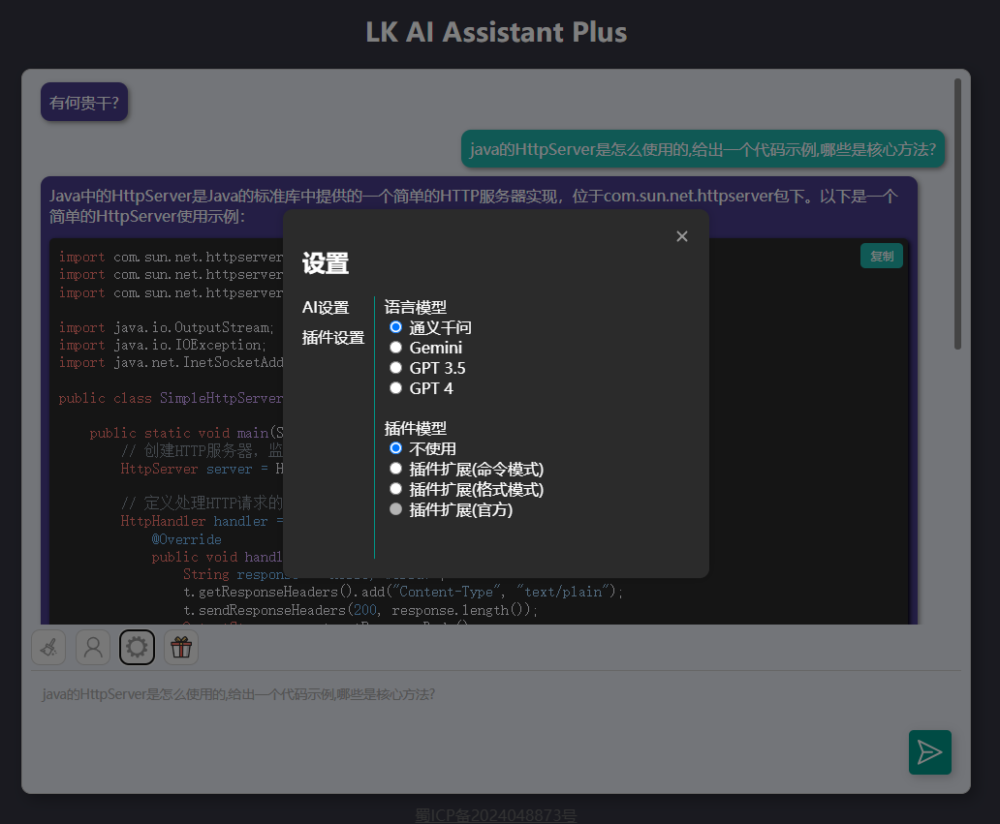

# AI-Assistant-Plus

该项目旨在为用户提供最单纯的AI入口,致力于解决用户在使用AI时面临的繁琐难题.
市面上的AI平台往往需要用户登录才能访问或者页面过于花里胡哨各种配置难免让人眼花缭乱，该项目真正做到即开即用，无需多余步骤，即刻享受AI带来的便捷服务.

## 语言模型

目前集成了通义千问,Gemini和ChatGPT三大前沿AI模型，可以无缝切换.

- 通义千问:阿里大模型
- Gemini:谷歌大模型
- GPT 3.5:ChatGPT3.5
- GPT 4:ChatGPT4

## 插件模型

基于不同的方式构建了不同的插件模型,GPT还支持原生官方模式.

- 原生:无插件调用能力,享受丝滑原生AI
- 插件扩展(命令模式):有插件调用能力,通过[插件]参数[插件]调用插件
- 插件扩展(格式模式):有插件调用能力,通过[思考,动作,输入]调用插件
- 插件扩展(官方):有插件调用能力,通过官方原生API实现调用插件

### 插件列表

实现了一系列简单实用的插件功能,如在线实时信息搜索,计算器等.

- 计算器
- Web浏览器
- Google搜索

## 展示

